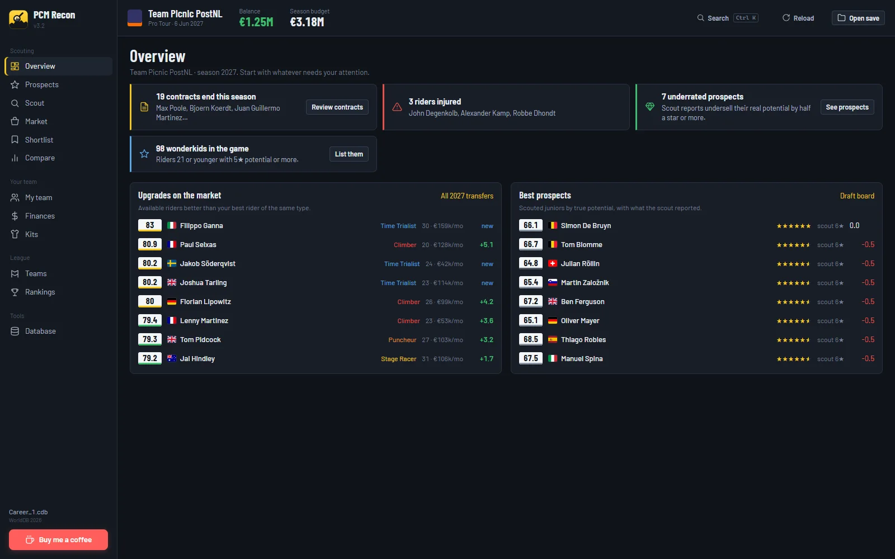
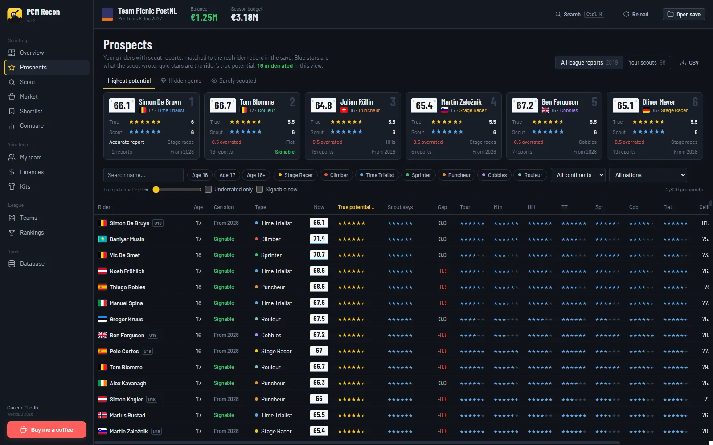
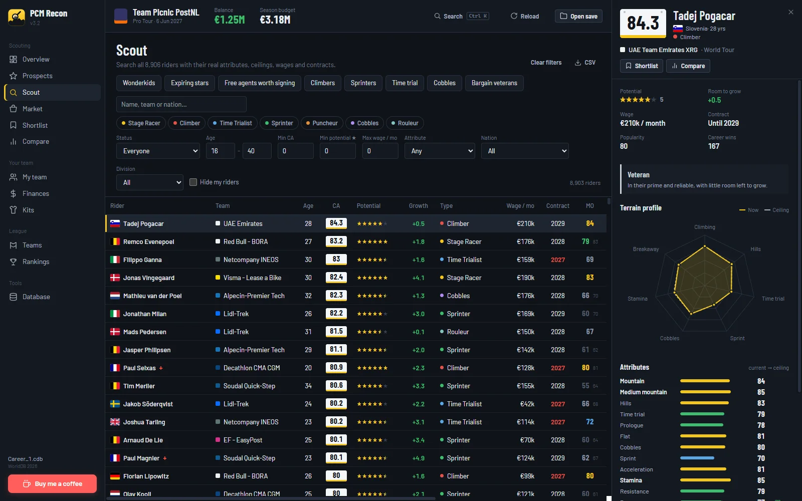
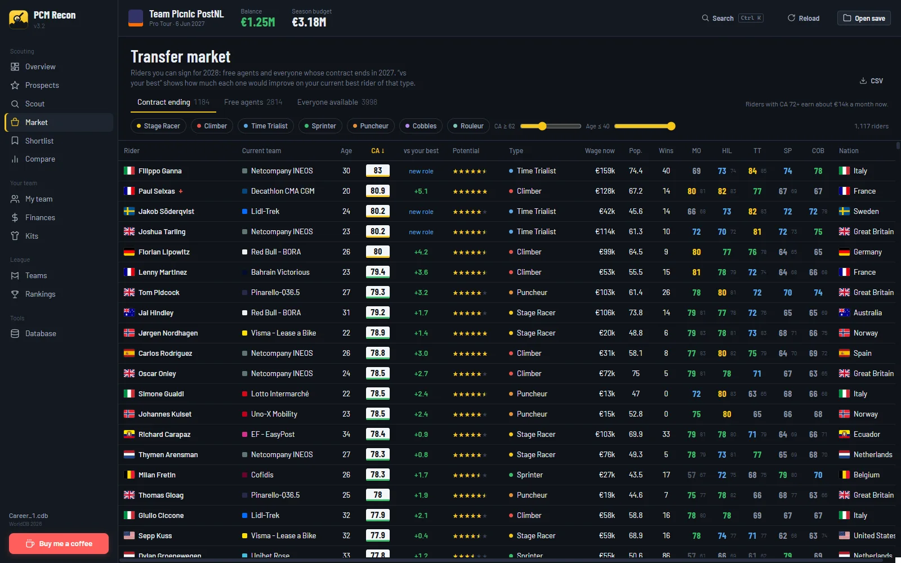
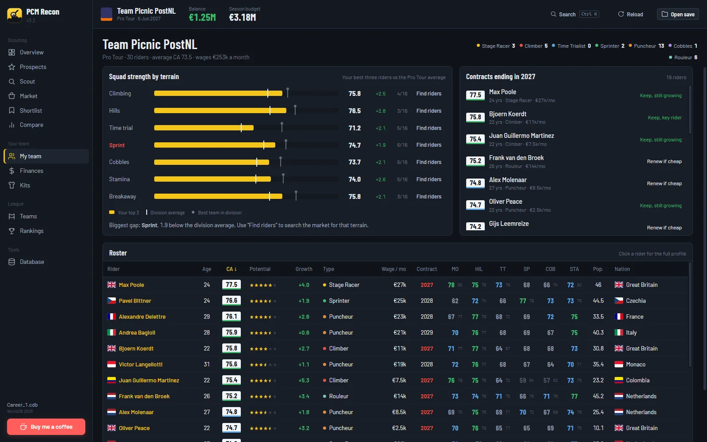
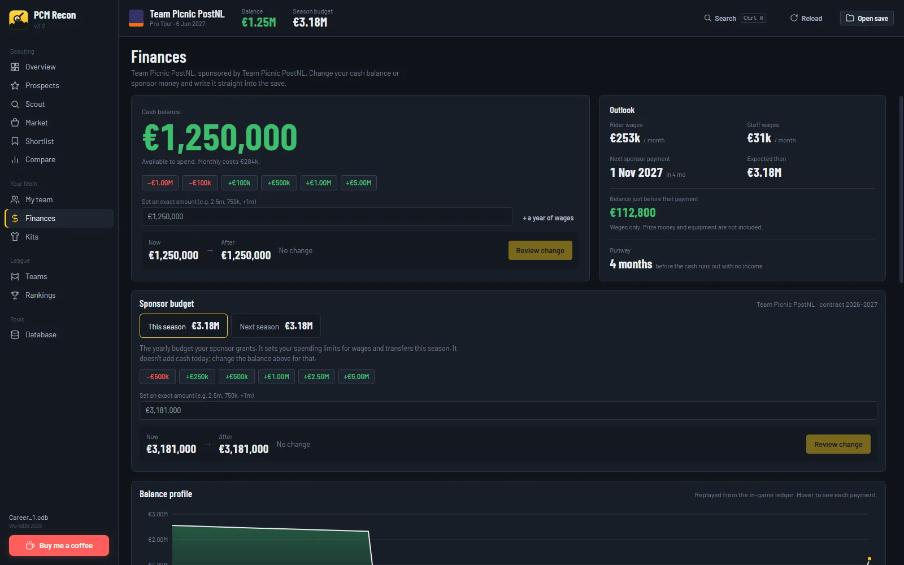
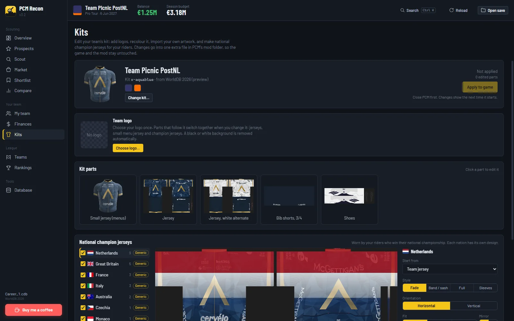
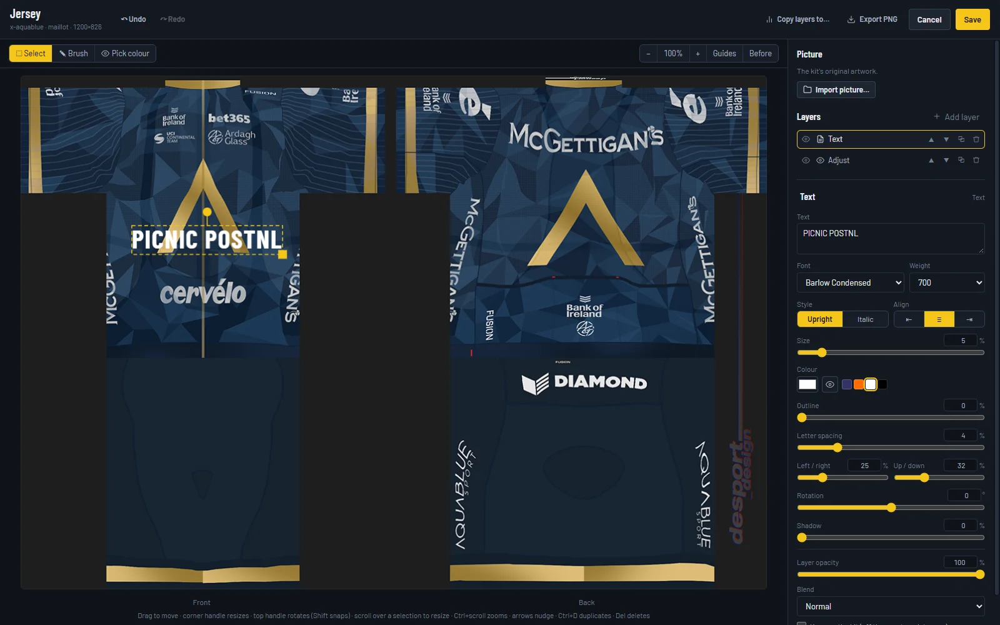

<p align="center"></p>

# PCM Recon

Scouting, finances and kit editing for your Pro Cycling Manager career. PCM Recon reads your career save (`.cdb`) directly and shows every rider's real attributes, ceilings, contracts and scout reports. It can also adjust your team's money and write it back into the save, and edit your team's kit in PCM 2026.

[](https://github.com/Venutian/pcm-recon/releases/latest)



> **Windows may say "Windows protected your PC"** the first time you run the installer, because the app isn't code-signed. Click **More info → Run anyway**.

## What it does

### Prospects

Every scout report in the league, matched to the real rider. See what the scout wrote next to the rider's true potential, and spot underrated "hidden gems" before your rivals do. Riders are marked as signable from the season they turn 18.



### Scout

Search all riders by type, age, ability, potential, wage, contract, nation, division or any attribute. Includes one-click presets (wonderkids, expiring stars, cheap veterans). Click a rider for the full profile: terrain radar, every attribute with its ceiling, wage and contract.



### Transfer market

Free agents and riders whose contracts end this season, with how much each one would improve your squad.



### My team

Squad strength by terrain compared with your division. "Find riders" jumps straight to market riders who fill the gap. Shows contracts ending this season with renew or let-go advice.



### Finances

Your cash balance, sponsor budget, wages, ledger, staff, equipment deals and sponsor offers. You can **set your balance** (clear a debt, add money) or change the sponsor budget for this season or next, then write it into the save.



### Kits (PCM 2026)

See which kit your team wears and switch to any kit in the game or your mod. Make national champion jerseys for every nationality in your squad in one go.



A layer-based kit editor works on every part, from the jersey to the bottle and the small menu jersey:

- logos and images (tint, flip, shadow) and text (fonts, outline, letter spacing)
- shapes (stars, chevrons, rounded panels, gradient fills), stripes, hoops, pinstripes, dots, checks and gradients
- flags as a fade, band, sash, full panel or on the sleeves, horizontal or vertical
- replace one colour with another while keeping the texture, plus hue, brightness, contrast and blur adjustments, and a paint brush
- blend modes, undo/redo, zoom, drag/resize/rotate handles, an eyedropper, and "copy layers to" other parts



Changes go into one extra file in PCM's `~mods` folder (`zz_pcmrecon_kits_P.pak`), so the game and your mod stay untouched, and **Remove from game** undoes everything.

### And more

**Teams, Rankings, Compare, Shortlist**, plus a read-only **Database** browser for every table in the save. Press **Ctrl K** anywhere to jump to a rider.

## Editing your save safely

1. In PCM, return to the main menu so the career isn't loaded.
2. Make the change in PCM Recon and confirm it.
3. Load the career again in PCM.

PCM Recon backs up the save before every change. You can restore any backup from **Finances → Backups**. Backups, notes and your shortlist are stored in the app's own data folder, never next to your saves.

## Using the kit editor

1. Open **Your team → Kits**. The first time, PCM Recon downloads Oodle (Epic Games' compression library, 2 MB, checksum verified), which it needs to read PCM's kit files.
2. Click a kit part to edit it, or make champion jerseys for your squad. Edits are saved in the app's data folder.
3. Close PCM, press **Apply to game**, then start PCM. Apply again after further edits.

Kits only work with PCM 2026 and later (the Unreal Engine versions).

## Building

```bash
npm install
npm run tauri dev      # run in development
npm run tauri build    # Windows installer
cd src-tauri && cargo test   # save tests use PCM_SAVE, or a .cdb in the repo root; skipped without one
```

## Support

Support development on [Ko-fi](https://ko-fi.com/venutian).
