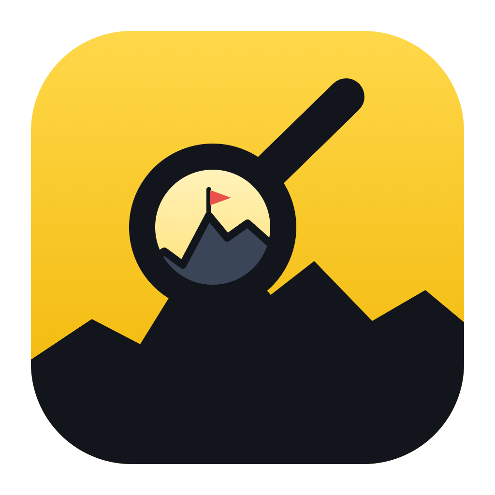

<p align="center"></p>

# PCM Recon

Scouting and finances for your Pro Cycling Manager career. PCM Recon reads your career save (`.cdb`) directly and shows every rider's real attributes, ceilings, contracts and scout reports. It can also adjust your team's money and write it back into the save.

[](https://github.com/Venutian/pcm-recon/releases/latest)

## What it does

- **Prospects.** Every scout report in the league, matched to the real rider. See what the scout wrote next to the rider's true potential, and spot underrated "hidden gems" before your rivals do. Riders are marked as signable from the season they turn 18.
- **Scout.** Search all riders by type, age, ability, potential, wage, contract, nation, division or any attribute. Includes one-click presets (wonderkids, expiring stars, cheap veterans).
- **Transfer market.** Free agents and riders whose contracts end this season, with how much each one would improve your squad.
- **My team.** Squad strength by terrain compared with your division. "Find riders" jumps straight to market riders who fill the gap. Shows contracts ending this season with renew or let-go advice.
- **Finances.** Your cash balance, sponsor budget, wages, ledger, staff, equipment deals and sponsor offers. You can **set your balance** (clear a debt, add money) or change the sponsor budget for this season or next, then write it into the save.
- **Teams, Rankings, Compare, Shortlist.** Plus a read-only **Database** browser for every table in the save.
- Press **Ctrl K** anywhere to jump to a rider.

## Editing your save safely

1. In PCM, return to the main menu so the career isn't loaded.
2. Make the change in PCM Recon and confirm it.
3. Load the career again in PCM.

PCM Recon backs up the save before every change. You can restore any backup from **Finances → Backups**. Backups, notes and your shortlist are stored in the app's own data folder, never next to your saves.

## Building

```bash
npm install
npm run tauri dev      # run in development
npm run tauri build    # Windows installer
cd src-tauri && cargo test   # parser tests (uses Career_*.cdb in the repo root if present)
```

## Support

Support development on [Ko-fi](https://ko-fi.com/venutian).
